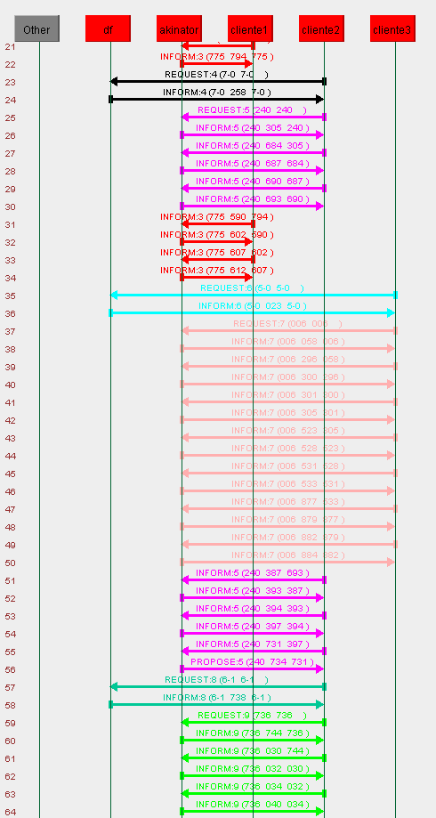
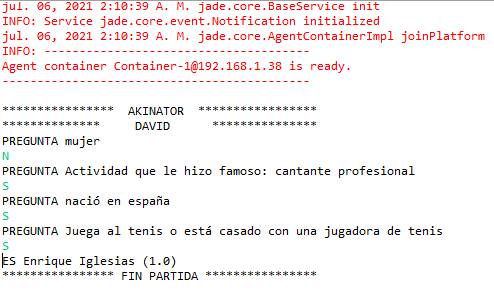
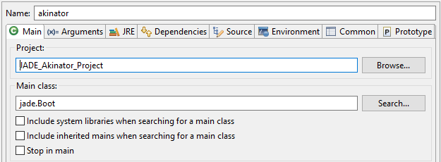
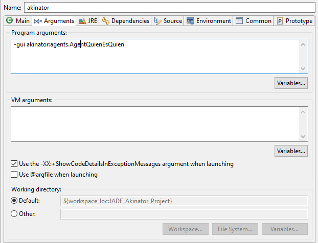
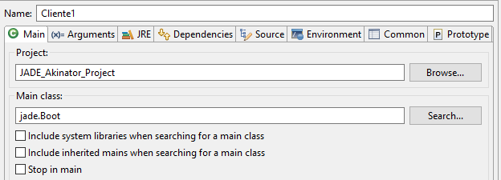
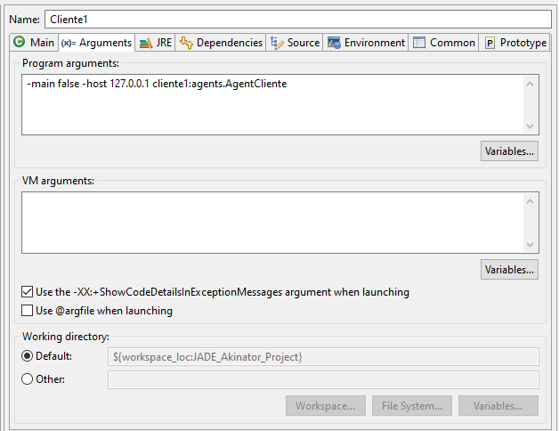

# JADE AKINATOR
Very small simulation of Akinator using JADE (Java Agent Development Framework).
 (For more information click [here](Practica_JADE.pdf))

## Usage
**Necessary Java JDK 12 or more to execute.**

### Usage option list
 Execute proyect in Eclipse IDE by downloading **"JADE_Akinator_Proyect" folder** and:
 - Create a new "Run Configuration" for Akinator like this example:

 - Create a new "Run Configuration" for each client that is going to play like this example:

